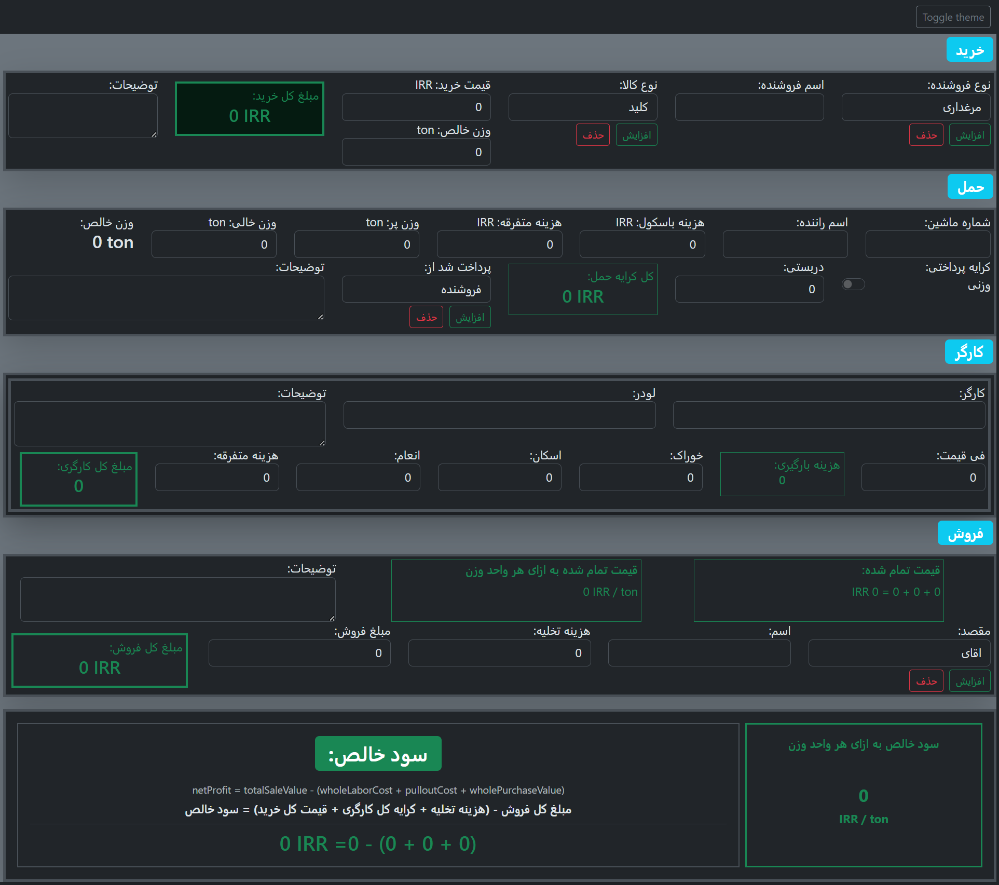

# Cargo Ledger

> A domain-driven, type-safe React application for automated cargo shipment pricing and logistics management.

[](https://www.typescriptlang.org/)
[](https://react.dev/)
[](https://vitejs.dev/)
[]()

---

## Table of Contents

- [Overview](#overview)
- [Why This Project Matters](#why-this-project-matters)
- [Key Features](#key-features)
- [Architecture](#architecture)
- [Technology Stack](#technology-stack)
- [Design Patterns & Best Practices](#design-patterns--best-practices)
- [Why TypeScript?](#why-typescript)
- [Project Structure](#project-structure)
- [Getting Started](#getting-started)
- [Learning Outcomes](#learning-outcomes)
- [Current Status](#current-status)

---

## Overview

**Cargo Ledger** is a professional-grade frontend application built for managing in-border cargo shipments with automated, intelligent pricing calculations. Born from real business requirements, it demonstrates **production-ready architecture patterns** including Domain-Driven Design, clean code principles, and advanced TypeScript patterns.

The application manages the complete shipment lifecycle:
- **Purchase**: Track incoming cargo details, pricing, and product classification
- **Transport**: Calculate shipping costs with flexible pricing models (per-weight or flat-rate)
- **Labor**: Manage labor costs including wages, accommodations, and gratuities
- **Selling**: Record final sales transactions

---



## Why This Project Matters

This project goes beyond typical CRUD applications. It showcases:

### Business Value
- Built for a **real in-border shipping company** with actual business logic
- Solves genuine operational complexity: multi-currency support, weight calculations, flexible pricing models
- Designed for immediate practical use

### Enterprise Architecture
- **Domain-Driven Design**: Business logic is completely separated from UI concerns
- **Layered Architecture**: Clear separation between presentation, features, and domain layers
- **Framework-Agnostic Domain**: The entire `src/domain/` directory can be ported to any backend without modification
- **Type-First Design**: Leverages TypeScript as a design tool, not an afterthought

### Production-Ready Patterns
- Custom error handling with domain-specific exceptions
- Pure functions for business calculations (testable, deterministic, side-effect free)
- Performance optimization with React's `useMemo` and proper dependency management
- Form state management with Formik integration using type-safe field validation

---

## Key Features

### Intelligent Pricing Engine
- **Multiple Pricing Models**: Support for both per-weight and flat-rate pricing strategies
- **Pure Calculation Functions**: `calculateWholePurchaseValue()`, `calculateShippingCost()`, `calculateWholeLaborCost()`
- **Multi-Currency Support**: Built-in support for USD, EUR, and IRR with type-safe Money value objects

### Multi-Factor Cost Calculations
- **Purchase Calculations**: Whole purchase value = unit price × net weight
- **Shipping Calculations**: Base cost (quantity/weight-based) + weighing fees + miscellaneous costs
- **Labor Calculations**: Wage + miscellaneous costs + tips + housing + feeding
- **Weight Calculations**: Net weight derivation with validation (full weight must exceed empty weight)

### Domain Validation Layer
- **Business Rule Enforcement**: Weight units must match across calculations
- **Domain-Specific Exceptions**: `DomainValidationError` tracks which field caused the error
- **Fail-Fast Design**: Validation happens in the domain layer before state changes

### Value Object Pattern
- **Money Type**: Combines amount with currency, preventing currency mismatch bugs
- **Weight Type**: Combines value with unit, enabling type-safe weight operations

### Type-Safe UI Components
- **NumericField**: Custom Formik integration for numeric inputs with thousand separators
- **FieldError**: Reusable error display component with styling
- **Responsive Forms**: Multi-section forms with dynamic field management

---

## Architecture

### Layered Architecture Diagram

```
┌─────────────────────────────────────────────────────────────────┐
│                    PRESENTATION LAYER (React)                   │
│                       App.tsx / InputRecord.tsx                  │
│  ┌─────────────────┬──────────────────┬──────────────┬─────────┐ │
│  │  PurchaseForm   │  TransportForm   │  LaborForm   │ SellForm│ │
│  └────────┬────────┴────────┬─────────┴──────┬───────┴────┬────┘ │
└───────────┼──────────────────┼────────────────┼────────────┼────────┘
            │                  │                │            │
┌───────────┼──────────────────┼────────────────┼────────────┼────────┐
│  FEATURES LAYER (Business-Aware Components)                        │
│  - Form state management with Formik                              │
│  - useMemo optimization of derived values                         │
│  - Integration between UI and domain logic                        │
└───────────┼──────────────────┼────────────────┼────────────┼────────┘
            │                  │                │            │
            └──────────────────┴────────────────┴────────────┘
                                │
┌───────────────────────────────┼────────────────────────────────────┐
│              DOMAIN LAYER (Framework-Agnostic)                    │
│                                                                    │
│  ┌──────────────────────────────────────────────────────────────┐ │
│  │  TYPES (Value Objects)                                       │ │
│  │  - Money { amount: number, currency: Currency }             │ │
│  │  - Weight { value: number, unit: WeightUnit }               │ │
│  │  - ShipmentInput, ShippingCostInput, WholeLaborCostInput    │ │
│  └──────────────────────────────────────────────────────────────┘ │
│                                                                    │
│  ┌──────────────────────────────────────────────────────────────┐ │
│  │  PURE FUNCTIONS (Calculation & Transformation)              │ │
│  │  - calculateWholePurchaseValue()                            │ │
│  │  - calculateNetWeight()                                     │ │
│  │  - calculateShippingCost()                                  │ │
│  │  - calculateWholeLaborCost()                                │ │
│  └──────────────────────────────────────────────────────────────┘ │
│                                                                    │
│  ┌──────────────────────────────────────────────────────────────┐ │
│  │  VALIDATION (Domain Rules)                                  │ │
│  │  - assertSameWeightUnit()                                   │ │
│  │  - assertFullExceedsEmpty()                                 │ │
│  │  - DomainValidationError (custom error type)               │ │
│  └──────────────────────────────────────────────────────────────┘ │
│                                                                    │
└────────────────────────────────────────────────────────────────────┘

┌─────────────────────────────────────────────────────────────────┐
│           SHARED LAYER (Reusable Components & Utils)             │
│  - NumericField, FieldError                                      │
│  - UI utilities: commafy, addValueToArr, removeValueFromArr      │
└─────────────────────────────────────────────────────────────────┘
```

### Architecture Principles

1. **Unidirectional Dependency**: UI depends on Features, Features depend on Domain. Domain has zero dependencies on UI or external libraries.
2. **Pure Functions in Domain**: All calculation functions are pure—same inputs always produce same outputs with no side effects.
3. **Value Objects**: Types like `Money` and `Weight` encapsulate both value and unit, preventing invalid states.
4. **Fail-Fast Validation**: Domain validators throw exceptions immediately when business rules are violated.
5. **Framework Agnostic Domain**: The entire `src/domain/` directory could be extracted and used in a Node.js backend, REST API, or CLI without changes.

---

## Technology Stack

| Layer | Technology | Purpose |
|-------|-----------|---------|
| **UI Framework** | React 19 | Modern component-based UI |
| **Language** | TypeScript 5.9 | Type safety and advanced language features |
| **Build Tool** | Vite 7 | Lightning-fast development and production builds |
| **Form State** | Formik 2.4 | Form state management and validation |
| **Validation** | Yup 1.7 | Schema validation library |
| **Styling** | Bootstrap 5 | Responsive UI framework |
| **Number Format** | react-number-format 5.4 | Internationalized number formatting |
| **Linting** | ESLint 9 + typescript-eslint | Code quality and consistency |

---

## Design Patterns & Best Practices

### 1. Domain-Driven Design (DDD)

The domain layer is the core of this application, containing pure business logic.

**Example: Pure Calculation Function**
```typescript
// src/domain/pricing/pricing.calculations.ts
export function calculateWholePurchaseValue(
  price: Money,
  weight: Weight
): number {
  return price.amount * weight.value;
}
```

**Why it matters**: This function is:
- **Pure**: No side effects, no external dependencies
- **Testable**: Easy to unit test with simple inputs/outputs
- **Reusable**: Can be used in React, Node.js, a REST API, or anywhere
- **Deterministic**: Same inputs always produce same output

### 2. Value Objects Pattern

Types like `Money` and `Weight` are more than just data structures—they're **semantic types** that prevent invalid states.

```typescript
// Domain types prevent invalid combinations
type Money = {
  amount: number;
  currency: Currency;  // Currency is part of the money, not separate
};

type Weight = {
  value: number;
  unit: WeightUnit;    // Unit is inseparable from value
};
```

**Benefits**:
- Prevents bugs like comparing USD amounts with EUR amounts
- Documents intent: `calculateShippingCost()` returns `Money`, not just `number`
- Type system prevents mixing incompatible units

### 3. Type Composition with `Pick<>`

Leverages TypeScript's `Pick` utility to create feature-specific form types from the master type.

```typescript
// Master type in features/inputRecord/inputRecord.types.ts
export type InputRecordFormValues = {
  purchaseNote: string;
  purchaseValue: number;
  netWeight: number;
  // ... 30+ fields total
};

// Feature-specific types (DRY - Don't Repeat Yourself)
export type PurchaseFormValues = Pick<
  InputRecordFormValues,
  | 'purchaseNote'
  | 'purchaseValue'
  | 'netWeight'
  | 'productType'
  | 'sellerName'
  | 'sellerType'
  | 'newProductType'
  | 'newSellerType'
>;
```

**Benefits**:
- Single source of truth for form fields
- Refactoring is safe: type errors appear immediately
- Feature forms are guaranteed to have valid fields

### 4. Custom Error Types

Domain-specific errors with field tracking for precise error reporting.

```typescript
// src/domain/domainErrors.ts
export class DomainValidationError extends Error {
  readonly field: keyof InputRecordFormValues;

  constructor(message: string, field: keyof InputRecordFormValues) {
    super(message);
    this.field = field;
    Object.setPrototypeOf(this, DomainValidationError.prototype);
  }
}

// Usage in validators
export function assertFullExceedsEmpty(full: Weight, empty: Weight) {
  if (empty.value > full.value) {
    throw new DomainValidationError(
      'Empty weight cannot exceed full weight',
      'emptyWeight'  // Exact field that failed
    );
  }
}
```

**Benefits**:
- Error handling knows which field to highlight
- Stack traces show domain logic, not just React internals
- Type-safe error handling

### 5. Performance Optimization with `useMemo`

Calculations are memoized to prevent unnecessary recalculations.

```typescript
// src/features/purchase/PurchaseForm.tsx
const wholePurchaseValue = useMemo<Money>(() => {
  const price: Money = {
    amount: values.purchaseValue,
    currency,
  };

  const weight: Weight = {
    value: values.netWeight,
    unit: weightUnit,
  };

  return calculateWholePurchaseValue(price, weight);
}, [values.purchaseValue, values.netWeight, currency, weightUnit]);
```

**Benefits**:
- Domain function isn't called on every render
- Proper dependency tracking prevents stale calculations
- Return type is explicitly `Money`, catching type errors at compile-time

### 6. Formik Integration Pattern

Custom components that integrate domain types with Formik state management.

```typescript
// src/shared/components/NumericField.tsx
const NumericField = ({ name, ...rest }: NumericFieldProps) => {
  const { setFieldValue, values, handleBlur } = useFormikContext<any>();

  const handleValueChange = (valuesObj: any) => {
    const { floatValue } = valuesObj;
    setFieldValue(name, floatValue ?? 0);
  };

  return (
    <NumericFormat
      {...rest}
      name={name}
      value={values[name]}
      className="form-control text-end"
      thousandSeparator=","
      onValueChange={handleValueChange}
      onBlur={handleBlur}
    />
  );
};
```

---

## Why TypeScript?

This project uses TypeScript not as an afterthought, but as a **design tool**. Here's why it matters:

### 1. Preventing Invalid States

Without TypeScript:
```javascript
function calculateShippingCost(quantity, netWeight, weighingFee, currency) {
  // Is weighingFee in the same currency? Who knows? Bug found in production.
  return quantity * netWeight + weighingFee;
}
```

With TypeScript (this project):
```typescript
function calculateShippingCost(input: ShippingCostInput): Money {
  // ShippingCostInput enforces that weighingFee IS a Money object with currency
  const base = input.pricingMode === 'PER_WEIGHT'
    ? input.quantity * input.net.value
    : input.quantity;

  return {
    amount: base + input.weighingFee.amount + input.shippMiscCost.amount,
    currency: input.weighingFee.currency,  // Type system ensures consistency
  };
}
```

### 2. Semantic Type Names

```typescript
// These aren't just numbers—they're meaningful types
type Currency = 'USD' | 'EUR' | 'IRR';
type WeightUnit = 'kg' | 'ton';
type PricingMode = 'PER_WEIGHT' | 'FLAT';
```

A developer reading the code immediately understands what values are valid.

### 3. Catching Errors at Compile-Time

```typescript
// This is caught by TypeScript, preventing the bug:
const cost: Money = calculateShippingCost(input);
const total = cost + 100;  // TypeScript Error: Cannot add Money and number

// Correct usage is clear:
const cost: Money = calculateShippingCost(input);
const total = { amount: cost.amount + 100, currency: cost.currency };
```

### 4. Refactoring Confidence

When you change a type structure:
```typescript
// If you change ShippingCostInput structure, TypeScript finds every place
// that calls calculateShippingCost() and shows compile errors until fixed
type ShippingCostInput = {
  // ... previous fields ...
  insuranceCost: Money;  // New field added
};
```

Without TypeScript, this bug would survive multiple code reviews and reach production.

### 5. Self-Documenting Code

The types ARE the documentation:
```typescript
// This type definition tells you EVERYTHING about what a shipment needs
type ShippingCostInput = {
  quantity: number;           // How many shipments?
  net: Weight;               // Already calculated, validated weight
  weighingFee: Money;        // Fee in specific currency
  shippMiscCost: Money;      // Misc in same currency
  pricingMode: PricingMode;  // Can only be 'PER_WEIGHT' or 'FLAT'
};
```

---

## Project Structure

```
cargo-ledger/
├── src/
│   ├── domain/                          # CORE BUSINESS LOGIC
│   │   ├── types.ts                     # Value Objects: Money, Weight, Currency
│   │   ├── domainErrors.ts              # DomainValidationError custom type
│   │   └── pricing/
│   │       ├── index.ts                 # Barrel exports
│   │       ├── pricing.types.ts         # Domain input/output types
│   │       ├── pricing.calculations.ts  # Pure functions (testable, reusable)
│   │       └── pricing.validators.ts    # Business rule validation
│   │
│   ├── features/                        # FEATURE-SPECIFIC LOGIC
│   │   ├── inputRecord/
│   │   │   ├── InputRecord.tsx          # Main form container with Formik
│   │   │   ├── inputRecord.types.ts     # Form state types (Pick<> pattern)
│   │   │   └── inputRecord.initialValues.ts  # Default form values
│   │   │
│   │   ├── purchase/
│   │   │   └── PurchaseForm.tsx         # Purchase section (خرید)
│   │   ├── transport/
│   │   │   └── TransportForm.tsx        # Shipping section
│   │   ├── labor/
│   │   │   └── LaborForm.tsx            # Labor costs section
│   │   └── Sell/
│   │       └── SellForm.tsx             # Sales section
│   │
│   ├── shared/                          # REUSABLE COMPONENTS & UTILS
│   │   ├── components/
│   │   │   ├── NumericField.tsx         # Formik-integrated numeric input
│   │   │   ├── FieldError.tsx           # Error message display
│   │   │   └── index.ts                 # Component exports
│   │   ├── hooks/                       # Custom React hooks (if added)
│   │   └── utils/
│   │       └── settings.ts              # Utility functions
│   │
│   ├── App.tsx                          # Root component (theme toggle)
│   ├── main.tsx                         # React entry point
│   └── index.css                        # Global styles
│
├── public/                              # Static assets
├── package.json                         # Dependencies & scripts
├── tsconfig.json                        # TypeScript configuration
├── vite.config.ts                       # Vite build configuration
├── eslint.config.js                     # Linting rules
└── README.md                            # This file

```

### Layer Responsibilities

**Domain Layer** (`src/domain/`)
- Pure business logic: calculations, transformations, validations
- No React, no HTTP, no external dependencies
- **Can be extracted and used in a Node.js backend without any changes**
- All functions are pure: same input = same output

**Features Layer** (`src/features/`)
- Feature-specific components and state management
- Formik integration and form field logic
- Uses domain functions to compute derived values
- Manages UI-specific state (show/hide dropdowns, etc.)
- Depends on domain layer

**Shared Layer** (`src/shared/`)
- Reusable components and utilities used across features
- NumericField: Formik + react-number-format integration
- Utility functions: string manipulation, array operations

**Presentation Layer** (`src/App.tsx`)
- Root React component
- Theme management
- Feature orchestration

---

## Getting Started

### Prerequisites

- **Node.js**: 18.x or higher
- **npm** or **yarn**: For dependency management

### Installation

```bash
# Clone the repository
git clone <repository-url>
cd cargo-ledger

# Install dependencies
npm install
```

### Development

```bash
# Start the development server (with hot module replacement)
npm run dev

# Application opens at http://localhost:5173
```

### Production Build

```bash
# Type-check and build for production
npm run build

# Preview the production build
npm run preview
```

### Code Quality

```bash
# Run ESLint to check code quality
npm run lint

# ESLint will catch:
# - TypeScript type errors
# - React hooks rules violations
# - Unused variables
# - Inconsistent formatting
```

---

## Learning Outcomes

This project demonstrates:

### Domain-Driven Design
- Business logic completely separated from UI framework
- Clear, semantic types that express business concepts
- Pure functions for calculations

### Type Safety
- Advanced TypeScript: Union Types, Mapped Types, Utility Types (`Pick<>`)
- Value Objects for semantic meaning
- Custom error types with field tracking

### React Best Practices
- Functional components with hooks
- `useMemo` for performance optimization
- Formik integration for form state management
- Custom components for code reuse

### Clean Code Architecture
- Layered architecture with clear separation of concerns
- Framework-agnostic business logic
- Testable code (even without tests written yet)
- Self-documenting types

### Real-World Application Design
- Multi-currency support considerations
- Complex calculation workflows
- Flexible pricing models
- Professional error handling

### Professional Development Practices
- Type-first design thinking
- Fail-fast validation
- Code organization that scales
- Intentional architectural decisions

---

## Current Status

### Implemented
- [x] Domain layer with calculations, validations, and type definitions
- [x] Purchase form with product type and seller management
- [x] Transport form with weight calculations and shipping costs
- [x] Labor form with cost aggregation
- [x] Sales form structure
- [x] Formik integration with custom numeric input field
- [x] Multi-currency support (USD, EUR, IRR)
- [x] Weight unit support (kg, ton)
- [x] Error handling and validation
- [x] Light/Dark theme toggle
- [x] Responsive Bootstrap layout

---

## Backend Compatibility

This project is **architected for backend integration**. The entire domain layer can be extracted and used in a Node.js backend:

```typescript
// Backend usage example (not yet implemented)
import {
  calculateWholePurchaseValue,
  calculateShippingCost,
  calculateWholeLaborCost,
} from './domain/pricing/pricing.calculations';

// Use in REST API endpoint
app.post('/api/shipments/calculate', (req, res) => {
  const cost = calculateShippingCost(req.body.shippingInput);
  res.json(cost);
});
```

---

## Code Examples

### Example: Pure Calculation Function

```typescript
// domain/pricing/pricing.calculations.ts
export function calculateNetWeight(
  full: Weight,
  empty: Weight
): Weight {
  // Validation happens in domain
  assertSameWeightUnit(full, empty, 'fullWeight');
  assertFullExceedsEmpty(full, empty);

  // Pure transformation
  return {
    value: full.value - empty.value,
    unit: full.unit,
  };
}
```

**This is production-grade because**:
- Validates business rules (same unit, full > empty)
- Returns typed result (Weight, not just number)
- No side effects
- Testable with simple assertions
- Self-documenting through types

### Example: Form Integration

```typescript
// features/purchase/PurchaseForm.tsx
const wholePurchaseValue = useMemo<Money>(() => {
  const price: Money = { amount: values.purchaseValue, currency };
  const weight: Weight = { value: values.netWeight, unit: weightUnit };

  // Domain function called with typed inputs, returns typed output
  return calculateWholePurchaseValue(price, weight);
}, [values.purchaseValue, values.netWeight, currency, weightUnit]);
```

---

## Design Decisions and Rationale

### Why Formik?
- **Industry standard** for React form state management
- **Battle-tested**: Used by thousands of production applications
- **Integrates well**: Custom fields like NumericField can wrap Formik context
- **Validation hooks**: Easy to add domain validation later

### Why Separate Domain from Features?
- **Reusability**: Domain logic works anywhere (React, Node.js, mobile)
- **Testability**: No need to mock React for domain tests
- **Maintainability**: Business logic isolated from UI framework changes
- **Team scalability**: Frontend and backend teams can work on same domain layer

### Why Value Objects (Money, Weight)?
- **Prevents bugs**: Can't accidentally compare USD with EUR
- **Type safety**: Compiler enforces correct combinations
- **Semantic meaning**: `Money` is clearer than `{ amount: number, currency: string }`
- **Extensibility**: Easy to add methods to Money (convert currency, format, etc.)

### Why Pure Functions in Domain?
- **Testable**: No mocks, no setup, just `assert result === expected`
- **Cacheable**: Same inputs always produce same output
- **Parallelizable**: Multiple pure functions can run concurrently
- **Debuggable**: No hidden state, no side effects to trace

---

## Contributing

This project is currently a portfolio piece. If you have suggestions for improvements or spot architectural issues, feel free to open an issue or discussion.

---

## License

MIT License - feel free to use this as a reference for your own projects.

---

## Author

Built as a demonstration of:
- Domain-Driven Design principles
- Clean architecture in React
- Advanced TypeScript patterns
- Professional code organization

**Real business requirement**: In-border cargo shipment tracking and pricing for a logistics company.

---


**Last Updated**: February 2026
**Status**: Active Development (Frontend Complete, Backend Planned)
